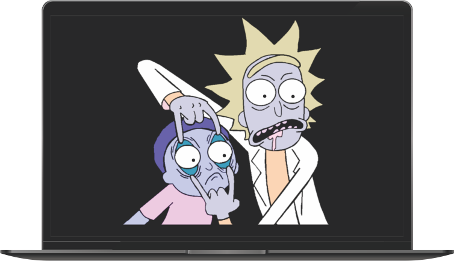

# EyeballsMoving


## O Projeto

<br />



> Projeto desenvolvido com o intuito de aprimorar minhas habilidades de HTML, CSS e Javascript; Consistindo em mover os olhos dos personagens acompanhando o mouse e alterar as cores da imagem que contém os personagens. Foi inspirado em um projeto apresentado no canal do Youtube [Beyond Fireship](https://www.youtube.com/channel/UC2Xd-TjJByJyK2w1zNwY0zQ).


## Tecnologias

- HTML
- CSS
- Javascript

## ☕ Desenvolvimento

O desenvolvimento deste projeto foi totalmente baseado em um vídeo do canal do Youtube ([How to make Eyeballs that Follow You Around](https://www.youtube.com/watch?v=TGe3pS5LqEw)). 

Além de movimentar os olhos de acordo com o movimento do mouse, foi utilizado o filtro ```hue-rotate``` com o intuito de aplicar na imagem onde os personagens "Rick and Morty" estão de acordo com o ângulo calculado para rotacionar os olhos dos personagens.

A diferença do projeto desenvolvido pelo canal [Beyond Fireship](https://www.youtube.com/channel/UC2Xd-TjJByJyK2w1zNwY0zQ) e o apresentado aqui consiste no ponto de referência tomado para que os olhos movimentem-se. No canal do Youtube foi proposto que os olhos moveriam-se tendo como referência o centro da imagem de "Rick and Morty" e, o que desenvolvi, os centros de referências são os próprios olhos dos personagens.

A diferença em código basicamente é

Código de [Beyond Fireship](https://www.youtube.com/channel/UC2Xd-TjJByJyK2w1zNwY0zQ):

```js
...

const anchor = document.getElementById("anchor");
const rect = document.getBoundingClientRect();
const anchorX = rect.left + rect.width / 2;
const anchorY = rect.top + rect.height / 2;

document.addEventListener("mousemove", (_el) => {
  ...

  const angleDeg = angle(mouseX, mouseY, anchorX, anchorY);
  eyes.forEach((_eye) => {
    _eye.style.transform = `rotate(${180 + angleDeg}deg)`;
    ...
  });
});

...
```

Código desenvolvido:

```js
...

const anchor = [];
const rects = [];
const anchorX = [];
const anchorY = [];

eyes.forEach((_eye) => {
  anchor.push(_eye);
  rects.push(_eye.getBoundingClientRect());
});

rects.forEach((_rect) => {
  anchorX.push(_rect.left + _rect.width / 2);
  anchorY.push(_rect.top + _rect.height / 2);
});

document.addEventListener("mousemove", (_el) => {
  ...

  eyes.forEach((_eye, _index) => {
    const angleDeg = angle(mouseX, mouseY, anchorX[_index], anchorY[_index]);
    _eye.style.transform = `rotate(${180 + angleDeg}deg)`;
    ...
  });
});

...
```

## 🚀 Instalação e Utilização

Basta clonar o projeto ou acessando [este link](https://diaspaulo.github.io/EyeballsMoving/)

[⬆ Voltar ao topo](#EyeballsMoving)
